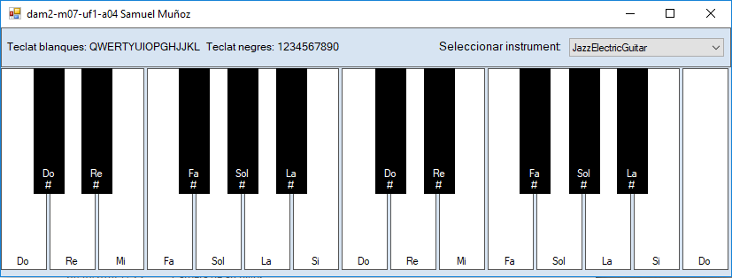

Very simple implementation of a MIDI 2-octave piano with 128 instruments using this library with C#-Windows Forms:
http://grouplab.cpsc.ucalgary.ca/cookbook/index.php/VisualStudio/HowToPlayMIDIInstruments

